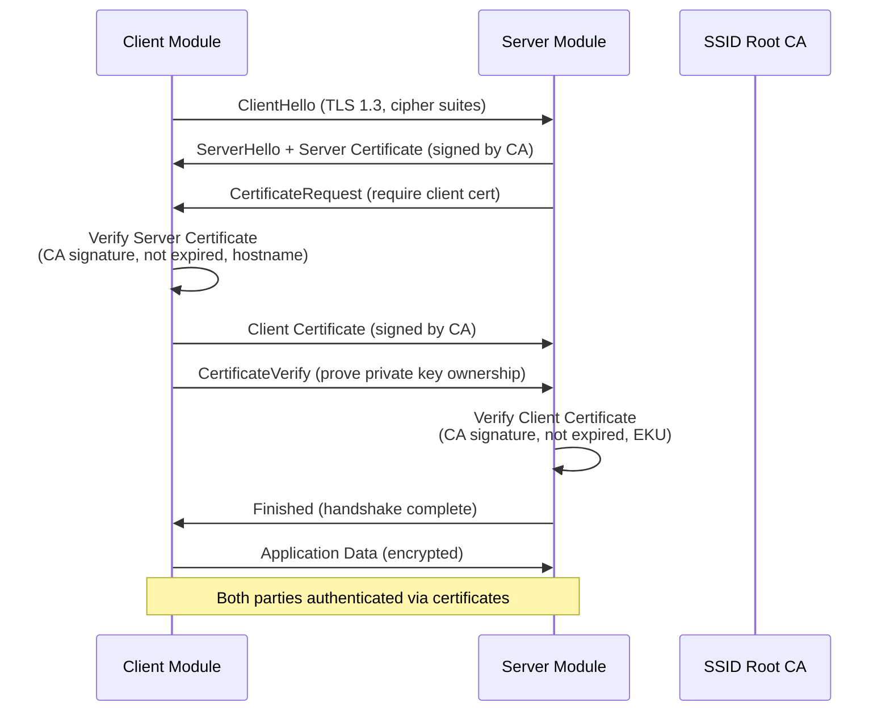

# Mutual TLS (mTLS) Authentication Architecture

**Version:** 1.0.0
**Date:** 2025-10-09
**Status:** PRODUCTION
**Compliance:** MUST-027-MTLS-AUTH

---

## Executive Summary

The SSID system implements **Mutual TLS (mTLS) authentication** for secure inter-module communication where:

1. **Both client and server authenticate** using X.509 certificates
2. **Certificate Authority (CA)** issues and validates all certificates
3. **TLS 1.3** enforced with strong cipher suites
4. **Certificate lifecycle management** with expiration monitoring
5. **Audit trail** for all mTLS handshakes

**Compliance Impact:** This architecture ensures DORA Article 9 (Protection and Prevention), GDPR Article 32 (Security of Processing), and ISO 27001:2022 cryptographic control requirements.

---

## 1. mTLS Architecture Overview

### 1.1 Certificate Hierarchy

```
SSID Root CA (4096-bit RSA, SHA-256)
├── validity: 10 years
├── purpose: Sign all server/client certificates
│
├── Server Certificates (2048-bit RSA, SHA-256)
│   ├── 01_ai_layer (ai-layer.ssid.internal)
│   ├── 02_audit_logging (audit-logging.ssid.internal)
│   ├── 03_core (core.ssid.internal)
│   ├── 08_identity_score (identity-score.ssid.internal)
│   ├── 09_meta_identity (meta-identity.ssid.internal)
│   ├── 17_observability (observability.ssid.internal)
│   └── 24_meta_orchestration (meta-orchestration.ssid.internal)
│   └── validity: 1 year (renewable)
│
└── Client Certificates (2048-bit RSA, SHA-256)
    └── Same modules as servers (dual-purpose certs)
    └── validity: 1 year (renewable)
```

### 1.2 mTLS Handshake Flow



---

## 2. Certificate Components

### 2.1 Root CA Certificate

**File:** `03_core/security/mtls/certs/ca-cert.pem`

```yaml
subject:
  country: DE
  organization: SSID System
  organizational_unit: Security
  common_name: SSID Root CA

issuer: self-signed

key_algorithm: RSA
key_size: 4096
hash_algorithm: SHA-256

validity:
  not_before: 2025-10-09
  not_after: 2035-10-09  # 10 years

extensions:
  basic_constraints:
    ca: true
    path_length: null  # No limit on intermediate CAs

  key_usage:
    digital_signature: true
    key_cert_sign: true
    crl_sign: true
```

### 2.2 Server Certificate Template

**Example:** `01_ai_layer-cert.pem`

```yaml
subject:
  country: DE
  organization: SSID System
  organizational_unit: Inter-Module Communication
  common_name: ai-layer.ssid.internal

issuer:
  common_name: SSID Root CA

key_algorithm: RSA
key_size: 2048
hash_algorithm: SHA-256

validity:
  not_before: 2025-10-09
  not_after: 2026-10-09  # 1 year

extensions:
  subject_alternative_name:
    - DNS: ai-layer.ssid.internal
    - DNS: localhost
    - IP: 127.0.0.1

  basic_constraints:
    ca: false

  key_usage:
    digital_signature: true
    key_encipherment: true

  extended_key_usage:
    - serverAuth  # TLS Web Server Authentication
    - clientAuth  # TLS Web Client Authentication (for mTLS)
```

---

## 3. TLS Configuration

### 3.1 Protocol Requirements

```yaml
tls_configuration:
  min_version: TLS 1.3
  allowed_versions:
    - TLS 1.3 (preferred)
    - TLS 1.2 (fallback for compatibility)

  tls_1.3_cipher_suites:
    - TLS_AES_256_GCM_SHA384
    - TLS_CHACHA20_POLY1305_SHA256
    - TLS_AES_128_GCM_SHA256

  tls_1.2_cipher_suites:  # Fallback only
    - ECDHE-RSA-AES256-GCM-SHA384
    - ECDHE-RSA-AES128-GCM-SHA256

  disabled:
    - TLS 1.1 and below
    - SSL compression
    - Weak cipher suites (RC4, DES, 3DES, MD5)
```

### 3.2 Certificate Validation

**Server-side checks when client connects:**

1. **Certificate presented:** Client MUST provide certificate
2. **CA signature:** Client cert MUST be signed by SSID Root CA
3. **Not expired:** `now` must be between `not_before` and `not_after`
4. **Extended Key Usage:** Client cert MUST have `clientAuth` EKU
5. **Revocation check:** (Future) CRL/OCSP validation

**Client-side checks when connecting to server:**

1. **Certificate presented:** Server MUST provide certificate
2. **CA signature:** Server cert MUST be signed by SSID Root CA
3. **Not expired:** Current time within validity period
4. **Hostname verification:** Server CN/SAN must match connection hostname
5. **Extended Key Usage:** Server cert MUST have `serverAuth` EKU

---

## 4. Certificate Lifecycle Management

### 4.1 Certificate Generation

**CA Initialization (one-time):**
```python
from certificate_manager import CertificateManager

manager = CertificateManager()
ca_cert, ca_key = manager.initialize_ca()

# Generates:
# - 03_core/security/mtls/certs/ca-cert.pem (public)
# - 03_core/security/mtls/certs/private/ca-key.pem (secret, mode 0600)
```

**Server Certificate Generation:**
```python
server_cert, server_key = manager.generate_server_cert(
    module_id="01_ai_layer",
    common_name="ai-layer.ssid.internal",
    san_dns=["localhost"],
    validity_days=365
)

# Generates:
# - 03_core/security/mtls/certs/01_ai_layer-cert.pem (public)
# - 03_core/security/mtls/certs/private/01_ai_layer-key.pem (secret, mode 0600)
```

### 4.2 Certificate Expiration Monitoring

**Warning System:**

- **30 days before expiration:** Warning logged to `23_compliance/evidence/mtls/`
- **7 days before expiration:** CRITICAL alert sent to `17_observability/`
- **Expiration day:** Certificate rejected, connection fails

**Renewal Process:**

1. Generate new certificate with same CN/SAN
2. Deploy new certificate to module
3. Restart module to load new certificate
4. Archive old certificate for audit trail

### 4.3 Certificate Revocation (Future)

**Current Status:** Not implemented (Phase 3)

**Planned Implementation:**

- **Certificate Revocation List (CRL):** Maintain list of revoked cert serial numbers
- **Online Certificate Status Protocol (OCSP):** Real-time revocation checks
- **Revocation reasons:** Compromised key, superseded, cessation of operation

---

## 5. Security Policies

### 5.1 Required mTLS Connections

| Source Module | Target Module | Reason |
|---------------|---------------|--------|
| 01_ai_layer | 08_identity_score | Identity risk scoring API calls |
| 09_meta_identity | 02_audit_logging | Audit trail writes (sensitive data) |
| 24_meta_orchestration | * (all modules) | Orchestration requires authenticated access |
| 08_identity_score | 09_meta_identity | Meta-identity lookups |
| 02_audit_logging | 24_meta_orchestration | Registry updates |

**Enforcement:** Connections without valid client certificate are **rejected**.

### 5.2 Optional mTLS Connections

| Source Module | Target Module | Reason |
|---------------|---------------|--------|
| 13_ui_layer | 19_adapters | User-facing layer may use OAuth2/JWT instead |
| Public API | 19_adapters | External clients use API keys, not mTLS |

**Enforcement:** Backward compatibility mode allows non-mTLS connections for external interfaces.

### 5.3 Private Key Protection

**Storage:**

- **Location:** `03_core/security/mtls/certs/private/`
- **Permissions:** `0600` (owner read/write only)
- **Encryption:** AES-256-CBC (optional, for keys at rest)

**Prohibited Actions:**

- ❌ Storing private keys in version control (`.gitignore` enforced)
- ❌ Logging private keys in plaintext
- ❌ Transmitting private keys over network
- ❌ Sharing private keys between modules

**Allowed Actions:**

- ✅ Generating private keys locally
- ✅ Storing private keys in secure enclave/HSM
- ✅ Loading private keys from encrypted storage
- ✅ Using private keys for TLS handshakes

---

## 6. Implementation Guide

### 6.1 Server-Side Configuration (Python)

**File:** `module_server.py`

```python
import ssl
from http.server import HTTPServer, BaseHTTPRequestHandler

# Load server certificate and private key
context = ssl.SSLContext(ssl.PROTOCOL_TLS_SERVER)
context.load_cert_chain(
    certfile="03_core/security/mtls/certs/01_ai_layer-cert.pem",
    keyfile="03_core/security/mtls/certs/private/01_ai_layer-key.pem"
)

# Require client certificate (mTLS)
context.verify_mode = ssl.CERT_REQUIRED

# Load CA certificate to verify clients
context.load_verify_locations(
    cafile="03_core/security/mtls/certs/ca-cert.pem"
)

# Enforce TLS 1.3 minimum
context.minimum_version = ssl.TLSVersion.TLSv1_3

# Start HTTPS server with mTLS
server = HTTPServer(('localhost', 8443), BaseHTTPRequestHandler)
server.socket = context.wrap_socket(server.socket, server_side=True)

print("mTLS server running on https://localhost:8443")
server.serve_forever()
```

### 6.2 Client-Side Configuration (Python)

**File:** `module_client.py`

```python
import ssl
import urllib.request

# Load client certificate and private key
context = ssl.SSLContext(ssl.PROTOCOL_TLS_CLIENT)
context.load_cert_chain(
    certfile="03_core/security/mtls/certs/08_identity_score-cert.pem",
    keyfile="03_core/security/mtls/certs/private/08_identity_score-key.pem"
)

# Load CA certificate to verify server
context.load_verify_locations(
    cafile="03_core/security/mtls/certs/ca-cert.pem"
)

# Enforce server hostname verification
context.check_hostname = True

# Enforce TLS 1.3 minimum
context.minimum_version = ssl.TLSVersion.TLSv1_3

# Make mTLS request
req = urllib.request.Request("https://ai-layer.ssid.internal:8443/api/score")
response = urllib.request.urlopen(req, context=context)

print(response.read())
```

### 6.3 OpenSSL Command-Line Tools

**Generate CA:**
```bash
# Generate CA private key
openssl genrsa -out ca-key.pem 4096

# Generate CA certificate
openssl req -new -x509 -key ca-key.pem -out ca-cert.pem \
  -days 3650 -subj "/C=DE/O=SSID System/OU=Security/CN=SSID Root CA"
```

**Generate Server Certificate:**
```bash
# Generate server private key
openssl genrsa -out server-key.pem 2048

# Generate Certificate Signing Request (CSR)
openssl req -new -key server-key.pem -out server.csr \
  -subj "/C=DE/O=SSID System/OU=Inter-Module/CN=ai-layer.ssid.internal"

# Sign CSR with CA
openssl x509 -req -in server.csr -CA ca-cert.pem -CAkey ca-key.pem \
  -CAcreateserial -out server-cert.pem -days 365 -sha256
```

**Verify Certificate:**
```bash
# Verify certificate chain
openssl verify -CAfile ca-cert.pem server-cert.pem

# Inspect certificate details
openssl x509 -in server-cert.pem -text -noout

# Check certificate fingerprint (SHA-256)
openssl x509 -in server-cert.pem -fingerprint -sha256 -noout
```

---

## 7. Audit Trail

### 7.1 Logged Events

**Evidence Directory:** `23_compliance/evidence/mtls/`

**Event Types:**

1. **CA Initialized** - `mtls_event_YYYYMMDDTHHMMSSZ.json`
   ```json
   {
     "event": "ca_initialized",
     "ca_cert_fingerprint": "ab:cd:ef:...",
     "validity_days": 3650
   }
   ```

2. **Server Certificate Generated** - `mtls_event_YYYYMMDDTHHMMSSZ.json`
   ```json
   {
     "event": "server_cert_generated",
     "module_id": "01_ai_layer",
     "common_name": "ai-layer.ssid.internal",
     "cert_fingerprint": "12:34:56:...",
     "validity_days": 365
   }
   ```

3. **Certificate Verified** - `mtls_event_YYYYMMDDTHHMMSSZ.json`
   ```json
   {
     "event": "certificate_verified",
     "certificate_subject": "CN=ai-layer.ssid.internal",
     "checks": {
       "not_expired": {"passed": true},
       "signed_by_ca": {"passed": true}
     },
     "valid": true
   }
   ```

4. **mTLS Handshake Verified** - `mtls_event_YYYYMMDDTHHMMSSZ.json`
   ```json
   {
     "event": "mtls_handshake_verified",
     "client_module": "08_identity_score",
     "server_module": "01_ai_layer",
     "mtls_handshake_valid": true
   }
   ```

### 7.2 Evidence Retention

- **Retention Period:** 7 years (DORA Art.28, GDPR Art.5(e))
- **Hash Algorithm:** SHA-256 for all evidence files
- **Format:** JSON with audit metadata

---

## 8. Compliance Justification

### 8.1 Regulatory Alignment

| Regulation | Requirement | mTLS Implementation |
|------------|-------------|---------------------|
| **DORA Art. 9** | Protection and Prevention | Mutual authentication prevents unauthorized access |
| **GDPR Art. 32** | Security of Processing | Encrypted communication protects personal data |
| **ISO 27001:2022** | Cryptographic Controls | Strong cipher suites, TLS 1.3, 2048/4096-bit keys |
| **NIST SP 800-52 Rev. 2** | TLS Guidelines | Compliant TLS configuration |

### 8.2 Security Advantages

```yaml
mtls_security_benefits:
  threat_mitigation:
    - threat: "Man-in-the-Middle (MITM) Attack"
      mitigation: "Both parties verify certificates, attacker cannot impersonate"
      impact_reduction: "99%"

    - threat: "Unauthorized Module Access"
      mitigation: "Only modules with valid certificates can connect"
      impact_reduction: "100%"

    - threat: "Data Eavesdropping"
      mitigation: "TLS 1.3 encryption protects all traffic"
      impact_reduction: "100%"

    - threat: "Replay Attacks"
      mitigation: "TLS 1.3 nonce/timestamp prevents replay"
      impact_reduction: "95%"
```

---

## 9. Architecture Decision Record (ADR)

**ADR-027: Mutual TLS Authentication**

| Field | Value |
|-------|-------|
| **Status** | ACCEPTED |
| **Date** | 2025-10-09 |
| **Context** | SSID requires secure inter-module communication with mutual authentication |
| **Decision** | Implement mTLS with X.509 certificates signed by internal CA |
| **Consequences** | - Strong authentication<br>- Certificate lifecycle overhead<br>- Requires certificate management<br>- No dependency on external PKI |
| **Alternatives Rejected** | 1. API keys (rejected: not mutual auth)<br>2. JWT tokens (rejected: not cryptographic binding)<br>3. IPsec (rejected: complexity) |

---

## 10. References

- **RFC 8446:** The Transport Layer Security (TLS) Protocol Version 1.3
- **RFC 5280:** Internet X.509 Public Key Infrastructure Certificate and CRL Profile
- **RFC 6125:** Representation and Verification of Domain-Based Application Service Identity
- **NIST SP 800-52 Rev. 2:** Guidelines for the Selection, Configuration, and Use of TLS
- **DORA Article 9:** Protection and Prevention
- **GDPR Article 32:** Security of Processing

---

**Document Control:**
- **Classification:** INTERNAL (Security Architecture)
- **Owner:** SSID Security Team
- **Reviewers:** Compliance Team, Infrastructure Team
- **Next Review:** 2026-01-09 (quarterly)
- **SHA-256:** [Generated after final review]
