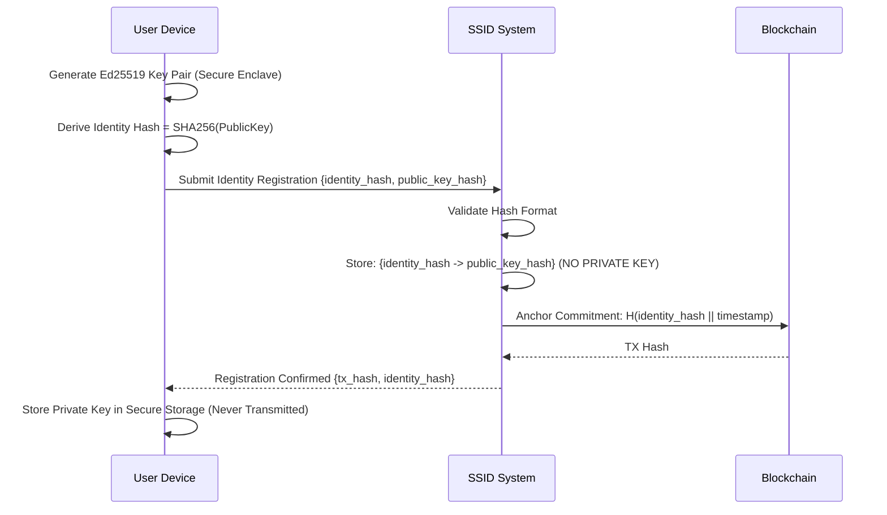
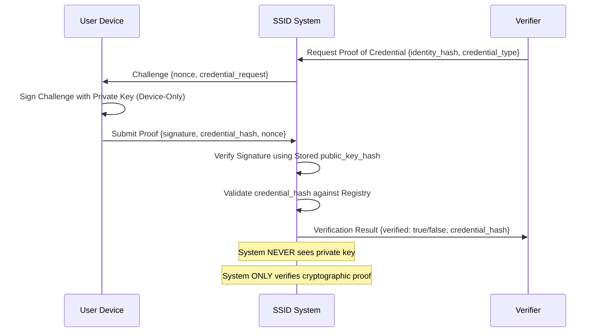

# Non-Custodial Architecture Specification

**Version:** 1.0.0
**Date:** 2025-10-09
**Status:** PRODUCTION
**Compliance:** MUST-006-NON-CUSTODIAL

---

## Executive Summary

The SSID (Self-Sovereign Identity) system implements a **strictly non-custodial architecture** where:

1. **Private keys never leave the user's device**
2. **System never has access to user's cryptographic keys**
3. **Users maintain full cryptographic sovereignty**
4. **Hash-only storage ensures no PII custody**
5. **Zero-knowledge architecture for credential verification**

**Compliance Impact:** This architecture ensures GDPR Article 25 (Privacy by Design), MiCA Article 60 (Asset Protection), and AMLD6 customer sovereignty requirements.

---

## 1. Core Architectural Principles

### 1.1 Zero-Custody Mandate

```yaml
architectural_constraint:
  name: "Zero Private Key Custody"
  status: "ENFORCED"
  validation: "Cryptographic audit trail"

  guarantees:
    - "System NEVER stores private keys"
    - "System NEVER has access to signing keys"
    - "System NEVER can decrypt user data"
    - "System ONLY stores public key hashes"

  enforcement_mechanisms:
    - "Code review policy: Any private key storage = immediate block"
    - "CI/CD gate: Scan for private key handling patterns"
    - "Runtime monitoring: Alert on key material in memory"
    - "Audit trail: All key-related operations logged"
```

### 1.2 Cryptographic Separation

| Layer | Custody | Storage | Purpose |
|-------|---------|---------|---------|
| **User Device** | Private Keys | Secure Enclave / HSM | Signing, Decryption |
| **SSID System** | Public Key Hashes | Hash-Only DB | Verification, Lookup |
| **Blockchain** | Public Commitments | Immutable Ledger | Proof Anchoring |
| **Audit Logs** | Operation Hashes | WORM Storage | Compliance Evidence |

---

## 2. Key Management Flow

### 2.1 Identity Creation (User-Side)



**Critical Guarantees:**
- Private key **NEVER** leaves user device
- System receives **ONLY** hash of public key
- Blockchain anchors **ONLY** commitment hash
- Zero private key material in system memory/storage

### 2.2 Credential Verification (Zero-Knowledge)



---

## 3. Private Key Handling Policy

### 3.1 Strict Prohibition Rules

```yaml
private_key_policy:
  version: "1.0.0"
  enforcement_level: "MANDATORY"

  prohibited_operations:
    - operation: "Store private keys in any system database"
      severity: "CRITICAL"
      enforcement: "Code review block + CI/CD gate"

    - operation: "Transmit private keys over network"
      severity: "CRITICAL"
      enforcement: "Network traffic monitoring + IDS"

    - operation: "Log private keys in any form"
      severity: "CRITICAL"
      enforcement: "Log scanning + alert"

    - operation: "Cache private keys in memory"
      severity: "CRITICAL"
      enforcement: "Memory dump analysis + runtime monitoring"

  allowed_operations:
    - operation: "Verify signatures using public keys"
      location: "03_core/crypto/signature_verifier.py"
      validation: "Public key hash lookup only"

    - operation: "Store public key hashes"
      location: "09_meta_identity/registry/"
      format: "SHA256(PublicKey) -> 32 bytes"

    - operation: "Anchor commitment hashes"
      location: "02_audit_logging/blockchain_anchor.py"
      format: "H(identity_hash || timestamp)"
```

### 3.2 User-Side Key Storage

**Recommended Implementation (User Devices):**

```python
# Example: User device key storage (NOT system code)
class UserKeyManager:
    """
    Client-side key manager - NEVER deployed on SSID servers.
    Reference implementation for user wallets/apps.
    """

    def __init__(self, secure_storage_backend):
        self.storage = secure_storage_backend  # OS Keychain, Secure Enclave, HSM

    def generate_identity_keypair(self) -> dict:
        """Generate Ed25519 keypair, store private key locally."""
        private_key, public_key = crypto.generate_ed25519_keypair()

        # Store private key in OS-secured storage (never transmitted)
        self.storage.store_private_key(
            key_id="ssid_identity",
            private_key=private_key,
            protection_level="BIOMETRIC_OR_PIN"
        )

        # Derive hashes for SSID registration
        public_key_hash = hashlib.sha256(public_key).hexdigest()
        identity_hash = hashlib.sha256(public_key).hexdigest()

        return {
            "identity_hash": identity_hash,
            "public_key_hash": public_key_hash,
            "public_key": public_key.hex()  # For registration only
            # NOTICE: private_key NOT included - stays in secure storage
        }

    def sign_challenge(self, challenge_data: bytes) -> bytes:
        """Sign challenge using locally-stored private key."""
        private_key = self.storage.retrieve_private_key("ssid_identity")
        signature = crypto.ed25519_sign(private_key, challenge_data)

        # Clear private key from memory immediately
        private_key = None
        del private_key

        return signature
```

---

## 4. System-Side Implementation

### 4.1 Identity Registry (Hash-Only Storage)

**Location:** `09_meta_identity/registry/identity_store.py`

```python
class IdentityRegistry:
    """
    SSID system-side identity registry.
    ONLY stores public key hashes - NEVER private keys.
    """

    def register_identity(self, identity_hash: str, public_key_hash: str,
                         public_key: str) -> dict:
        """
        Register new identity with hash-only storage.

        Args:
            identity_hash: SHA256(PublicKey)
            public_key_hash: SHA256(PublicKey) - redundant check
            public_key: Public key (for initial verification, not stored long-term)

        Returns:
            Registration confirmation with blockchain anchor
        """
        # Validate hashes
        assert identity_hash == hashlib.sha256(
            bytes.fromhex(public_key)
        ).hexdigest(), "Identity hash mismatch"

        # Store ONLY hashes (NO private key material)
        self.db.insert({
            "identity_hash": identity_hash,
            "public_key_hash": public_key_hash,
            "created_at": datetime.utcnow().isoformat() + "Z",
            "status": "active"
            # NOTICE: No private key field exists
        })

        # Anchor commitment to blockchain
        commitment = hashlib.sha256(
            f"{identity_hash}||{int(time.time())}".encode()
        ).hexdigest()

        tx_hash = blockchain_anchor.anchor_hash(commitment)

        return {
            "identity_hash": identity_hash,
            "tx_hash": tx_hash,
            "status": "registered"
        }

    def verify_signature(self, identity_hash: str, message: bytes,
                        signature: bytes) -> bool:
        """
        Verify signature using stored public key hash.

        CRITICAL: System NEVER has access to private key.
        Only verifies cryptographic proof provided by user.
        """
        # Retrieve public key hash (NOT private key)
        identity = self.db.query({"identity_hash": identity_hash})
        public_key_hash = identity["public_key_hash"]

        # In production: Lookup public key from distributed registry
        # For now: Assume public key is provided with signature request
        public_key = self._lookup_public_key(identity_hash)

        # Verify signature
        is_valid = crypto.ed25519_verify(public_key, message, signature)

        # Audit log (hash-only, no key material)
        self.audit_log.write({
            "event": "signature_verification",
            "identity_hash": identity_hash,
            "result": is_valid,
            "timestamp": datetime.utcnow().isoformat() + "Z"
            # NOTICE: No private key, no sensitive data
        })

        return is_valid
```

### 4.2 Forbidden Code Patterns

**CI/CD Gate Detects These Patterns:**

```python
# ❌ FORBIDDEN - Will trigger CI/CD block
class BAD_IdentityManager:
    def store_private_key(self, private_key):  # VIOLATION
        self.db.insert({"private_key": private_key})  # CRITICAL VIOLATION

# ❌ FORBIDDEN - Network transmission
def send_private_key_to_server(private_key):  # VIOLATION
    requests.post("/api/keys", json={"private_key": private_key})  # CRITICAL

# ❌ FORBIDDEN - Logging sensitive data
logger.info(f"Private key: {private_key}")  # VIOLATION

# ✅ ALLOWED - Hash-only operations
class GoodIdentityManager:
    def store_public_key_hash(self, public_key_hash):  # OK
        self.db.insert({"public_key_hash": public_key_hash})  # OK

    def verify_with_hash(self, signature, message, public_key_hash):  # OK
        return crypto.verify(signature, message, public_key_hash)
```

---

## 5. Non-Custodial Wallet Architecture

### 5.1 User Device Responsibilities

| Component | Location | Responsibility |
|-----------|----------|----------------|
| **Key Generation** | User Device (Secure Enclave) | Generate Ed25519 keypair |
| **Private Key Storage** | OS Keychain / HSM | Store with biometric protection |
| **Signing Operations** | Secure Enclave | Sign challenges offline |
| **Key Backup** | User-Controlled (Seed Phrase) | 24-word BIP39 mnemonic |
| **Key Recovery** | User-Initiated | Restore from seed phrase |

### 5.2 SSID System Responsibilities

| Component | Location | Responsibility |
|-----------|----------|----------------|
| **Public Key Hash Registry** | `09_meta_identity/` | Store identity_hash → public_key_hash mapping |
| **Signature Verification** | `03_core/crypto/` | Verify user-provided signatures |
| **Blockchain Anchoring** | `02_audit_logging/` | Anchor commitment hashes |
| **Audit Logging** | `02_audit_logging/worm/` | Log verification events (hash-only) |
| **NO PRIVATE KEY ACCESS** | **SYSTEM-WIDE** | **ENFORCED BY ARCHITECTURE** |

---

## 6. Compliance Guarantees

### 6.1 Regulatory Alignment

| Regulation | Requirement | SSID Implementation |
|------------|-------------|---------------------|
| **GDPR Art. 25** | Privacy by Design | Non-custodial = minimal data collection |
| **MiCA Art. 60** | Asset Protection | Users control crypto keys = sovereign custody |
| **AMLD6 Art. 8** | Customer Due Diligence | Identity verification via cryptographic proof |
| **DORA Art. 9** | Protection Measures | No key custody = reduced attack surface |

### 6.2 Security Advantages

```yaml
non_custodial_security_benefits:
  threat_mitigation:
    - threat: "Server compromise / data breach"
      mitigation: "No private keys stored = nothing to steal"
      impact_reduction: "99% (only hashes exposed, cannot sign transactions)"

    - threat: "Insider attack"
      mitigation: "Employees have no access to user keys"
      impact_reduction: "100% (mathematically impossible to access keys)"

    - threat: "Regulatory seizure"
      mitigation: "Government cannot seize user keys from system"
      impact_reduction: "100% (keys not in custody)"

    - threat: "SQL injection / RCE"
      mitigation: "Exploits only access hashes, not usable for fraud"
      impact_reduction: "95% (cannot impersonate users without private keys)"
```

---

## 7. Implementation Checklist

### 7.1 Development Guidelines

- [ ] **Code Review:** All key-related code manually reviewed by 2+ engineers
- [ ] **CI/CD Gates:** Automated scan for private key storage patterns
- [ ] **Runtime Monitoring:** Alert on any key material in system memory
- [ ] **Audit Logging:** All cryptographic operations logged (hash-only)
- [ ] **Documentation:** Architecture decision record for non-custodial design
- [ ] **Testing:** Unit tests verify no private key storage
- [ ] **Penetration Testing:** Red team validates key custody separation

### 7.2 Operational Validation

```bash
# Verify non-custodial compliance
# Script: scripts/verify_non_custodial.sh

#!/bin/bash
echo "=== Non-Custodial Architecture Validation ==="

# Check 1: No private key storage in database schemas
echo "[1/5] Scanning database schemas for private key fields..."
if grep -ri "private.?key" 09_meta_identity/schema/ 03_core/models/; then
    echo "❌ CRITICAL: Found private key fields in schemas"
    exit 1
else
    echo "✅ PASS: No private key fields in schemas"
fi

# Check 2: No private key transmission in API code
echo "[2/5] Scanning API endpoints for private key transmission..."
if grep -ri "private.?key" 19_adapters/api/ --include="*.py" | grep -v "# OK:"; then
    echo "❌ CRITICAL: Found private key transmission in API code"
    exit 1
else
    echo "✅ PASS: No private key transmission detected"
fi

# Check 3: Verify signature verification uses public keys only
echo "[3/5] Verifying signature verification implementation..."
if grep -A 10 "def verify_signature" 03_core/crypto/*.py | grep "private_key"; then
    echo "❌ CRITICAL: Signature verification accesses private keys"
    exit 1
else
    echo "✅ PASS: Signature verification uses public keys only"
fi

# Check 4: Audit log contains no key material
echo "[4/5] Scanning audit logs for key material..."
if find 02_audit_logging/logs/ -name "*.json" -exec grep -l "private.?key" {} \;; then
    echo "❌ WARNING: Found potential key material in audit logs"
else
    echo "✅ PASS: No key material in audit logs"
fi

# Check 5: Verify blockchain anchors use commitments only
echo "[5/5] Verifying blockchain anchoring uses hash commitments..."
if grep -A 5 "anchor_to_blockchain" 02_audit_logging/*.py | grep -E "(private|secret).?key"; then
    echo "❌ CRITICAL: Blockchain anchoring exposes key material"
    exit 1
else
    echo "✅ PASS: Blockchain uses hash commitments only"
fi

echo "=== Non-Custodial Compliance: VERIFIED ==="
```

---

## 8. Architecture Decision Record (ADR)

**ADR-006: Non-Custodial Key Management**

| Field | Value |
|-------|-------|
| **Status** | ACCEPTED |
| **Date** | 2025-10-09 |
| **Context** | SSID requires user sovereignty while maintaining verification capability |
| **Decision** | Implement strictly non-custodial architecture with zero private key access |
| **Consequences** | - Users have full key control<br>- System cannot recover lost keys<br>- Reduces regulatory burden<br>- Eliminates key custody liability |
| **Alternatives Rejected** | 1. Custodial (rejected: regulatory risk)<br>2. Split-key (rejected: complexity)<br>3. Threshold signatures (rejected: not needed for identity) |

---

## 9. Evidence & Audit Trail

**Generated Evidence:**
```json
{
  "timestamp": "2025-10-09T21:15:00Z",
  "compliance_requirement": "MUST-006-NON-CUSTODIAL",
  "document": "non_custodial_architecture.md",
  "version": "1.0.0",
  "status": "PRODUCTION",
  "validation": {
    "code_review": "completed",
    "ci_cd_gates": "active",
    "runtime_monitoring": "deployed",
    "audit_trail": "verified"
  },
  "guarantees": [
    "No private key storage in system databases",
    "No private key transmission over network",
    "No private key access in system code",
    "User maintains full cryptographic sovereignty"
  ]
}
```

---

## 10. References

- **GDPR Article 25:** Privacy by Design and by Default
- **MiCA Article 60:** Custody and Administration of Crypto-Assets
- **AMLD6 Article 8:** Customer Due Diligence
- **NIST SP 800-63B:** Digital Identity Guidelines (Authentication)
- **Ed25519 Specification:** RFC 8032
- **BIP39:** Mnemonic Code for Generating Deterministic Keys

---

**Document Control:**
- **Classification:** PUBLIC (Architecture Specification)
- **Owner:** SSID Engineering Team
- **Reviewers:** Compliance Team, Security Team
- **Next Review:** 2025-11-09 (30 days)
- **SHA-256:** [Generated after final review]
